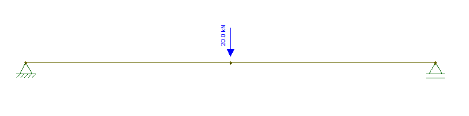
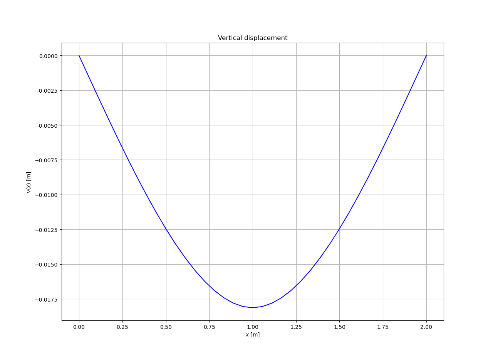
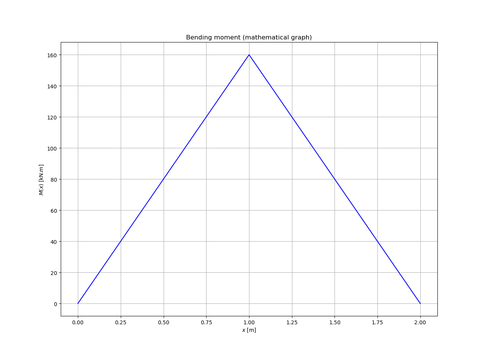
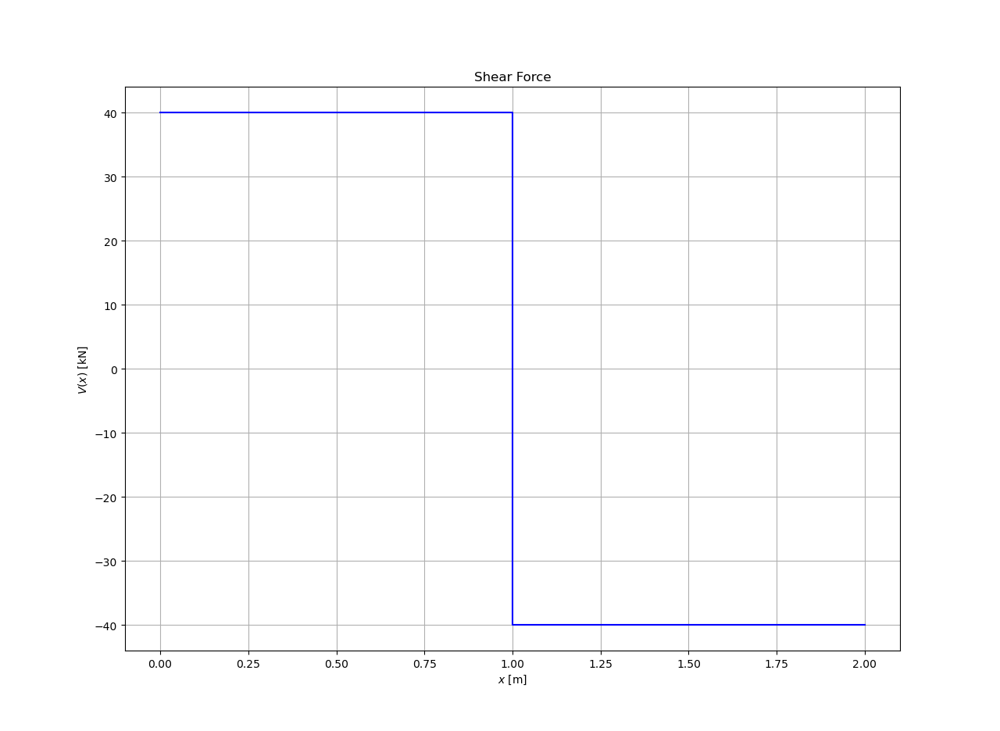

# AN EULER-BERNOULLI-LIKE FINITE ELEMENT METHOD FOR TIMOSHENKO BEAMS
## Implementation of the G. Falsone and D. Settineri article.

Article can be found [here](https://www.researchgate.net/publication/251506561_An_Euler-Bernoulli-like_finite_element_method_for_Timoshenko_beams).


Based on the formulation made by Falsone and Settineri, the procedure to simplify the problem of TBM to a EBBM-like FE is presentened in [this](EF2_rescritura_articulo_michaelherediaperez.pdf) document more clearly.

## Stiffness matrix and Equivalent nodal forces vector

The computation of **K** and **f** for the 2-noded Timoshenko finite element proposed by the authors was made employing numerical integration over a Gauss-Legendre quadrature domain. The results are shown here for **K**:

```
K =

⎡   3⋅A⋅E⋅G⋅I⋅Le⋅α        3⋅A⋅E⋅G⋅I⋅Le⋅α            -3⋅A⋅E⋅G⋅I⋅Le⋅α           3⋅A⋅E⋅G⋅I⋅Le⋅α       ⎤    
⎢ ─────────────────   ─────────────────      ────────────────      ─────────────────   ⎥ 
⎢ 4⋅(A⋅G⋅α + 3⋅E⋅I)     4⋅(A⋅G⋅α + 3⋅E⋅I)          4⋅A⋅G⋅α + 12⋅E⋅I         4⋅(A⋅G⋅α + 3⋅E⋅I)    ⎥
⎢                                                                                      ⎥
⎢   3⋅A⋅E⋅G⋅I⋅Le⋅α     E⋅I⋅Le⋅(4⋅A⋅G⋅α + 3⋅E⋅I)      -3⋅A⋅E⋅G⋅I⋅Le⋅α       E⋅I⋅Le⋅(2⋅A⋅G⋅α - 3⋅E⋅I)  ⎥
⎢ ─────────────────  ────────────────────   ────────────────     ────────────────────  ⎥
⎢ 4⋅(A⋅G⋅α + 3⋅E⋅I)     4⋅(A⋅G⋅α + 3⋅E⋅I)          4⋅A⋅G⋅α + 12⋅E⋅I      4⋅(A⋅G⋅α + 3⋅E⋅I)       ⎥
⎢                                                                                      ⎥
⎢ -3⋅A⋅E⋅G⋅I⋅Le⋅α        -3⋅A⋅E⋅G⋅I⋅Le⋅α            3⋅A⋅E⋅G⋅I⋅Le⋅α       -3⋅A⋅E⋅G⋅I⋅Le⋅α           ⎥
⎢ ────────────────   ────────────────       ─────────────────      ────────────────    ⎥
⎢ 4⋅A⋅G⋅α + 12⋅E⋅I       4⋅A⋅G⋅α + 12⋅E⋅I          4⋅(A⋅G⋅α + 3⋅E⋅I)      4⋅A⋅G⋅α + 12⋅E⋅I       ⎥
⎢                                                                                      
⎢   3⋅A⋅E⋅G⋅I⋅Le⋅α      E⋅I⋅Le⋅(2⋅A⋅G⋅α - 3⋅E⋅I)    -3⋅A⋅E⋅G⋅I⋅Le⋅α       E⋅I⋅Le⋅(4⋅A⋅G⋅α + 3⋅E⋅I)  ⎥
⎢ ─────────────────  ─────────────────────  ────────────────   ────────────────────   ⎥
⎣ 4⋅(A⋅G⋅α + 3⋅E⋅I)     4⋅(A⋅G⋅α + 3⋅E⋅I)         4⋅A⋅G⋅α + 12⋅E⋅I      4⋅(A⋅G⋅α + 3⋅E⋅I)       ⎦

```

and for **f** considering ***q*** as a linear distributed load:

```
f =

⎡       0.5⋅Le⋅q         ⎤
⎢                       ⎥
⎢0.166666666666667⋅Le⋅q  ⎥
⎢                       ⎥
⎢       0.5⋅Le⋅q         ⎥
⎢                       ⎥
⎣-0.166666666666667⋅Le⋅q ⎦

```

Both were calculated with this code:

* [03_K_f_falsone_settineri.py](03_K_f_falsone_settineri.py)

And the Hermite shape functions with this:

* [01_hermite_shape_functions.py](01_hermite_shape_functions.py)

In the end of the article appears a pair of interdependnet shape functions that are barely coded here:

* [02_interdependent_shape_functions.py](02_interdependent_shape_functions.py)


## Implementation example

The beam shown in the figure was analized with the folllowing code:

* [07_FS_implementation.py](07_FS_implementation.py)



The properties of the beam can be found in the code. It is worth to say that it may be an error in the computation of the matrix **K**, because as we see in the graphics of the vertical displacement, rotation angle, bending moment and shear force, ALL OF THEM ARE MORE THAN WHAT THEY ARE SUPPOSED TO BE.





 
### NOTE

**I am still looking for the error.**