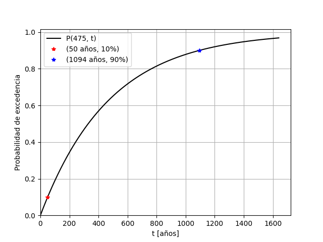
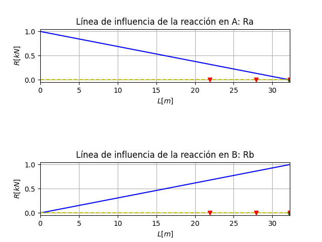
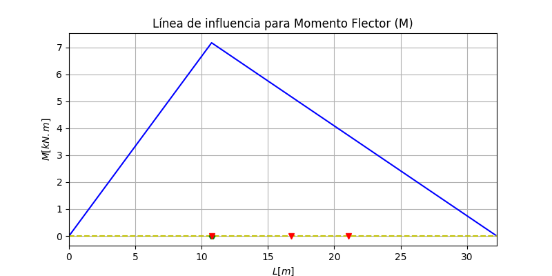
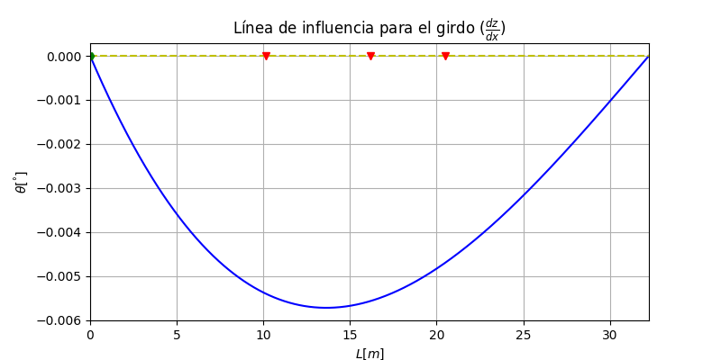
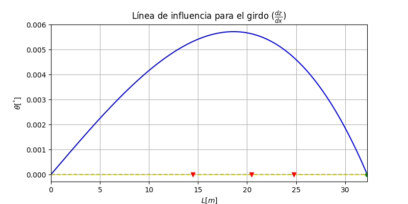
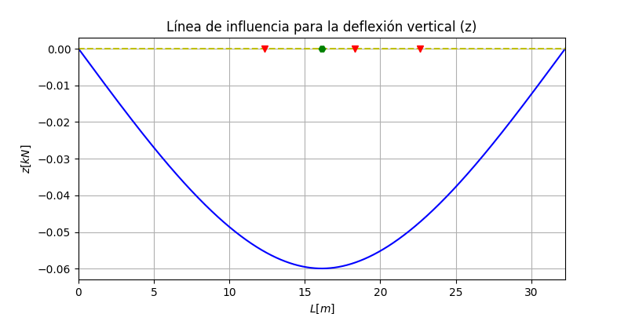

# Diseño de puentes

* ```LI.py```: Usado en ```p3.py```: Calcula y grafica las lineas de influencia.

* ```p1.py```: Evolución de laa probabilidad de excedencia del period de retorno $T_r$ de 475 años.

<p align="center">
 
</p>

* ```p2.py```: Cálculo de desplazamientos espectrales, modelo masa-resorte de 1gdl.


* ```p3.py```: Cálculo de la posición desde el apoyo A de un camión, en una viga simplemente apoyada, para maximizar variables. Los triángulos rojos son los ejes del camión y el hexágno verde es el punto de análisis.

<p align="center">
 
</p>

<p align="center">
 
</p>

<p align="center">
 
</p>

<p align="center">
 
</p>

<p align="center">
 
</p>